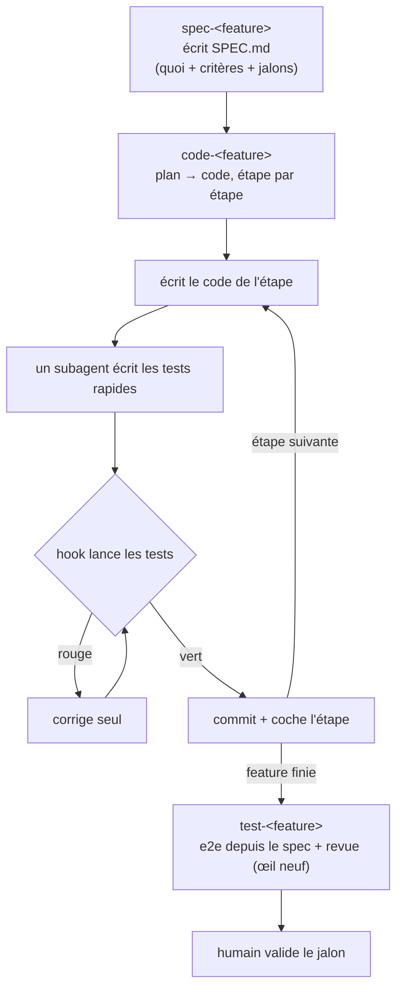

# ai-founder-workflow — kit de workflow IA pour solo founders et équipes dev

Un modèle de sessions **répétable** pour piloter Claude Code : par feature côté build, par sujet côté découverte (incl. tickets support), par output côté audience. Avec une **vérification automatisée** sur le build et un **contexte qui reste propre** sur tous les axes. Conçu pour être **déployé sur n'importe quel repo**.

> **Pour qui** : les **solo founders** (qui font tout — dev, contenu, sales-discovery, support clients) et les **équipes dev** qui veulent un workflow IA cohérent et partageable.
> **Sur quoi** : n'importe quel repo de l'équipe.
> **Ce que ça remplace** : l'organisation « une session par rôle » (product / frontend / backend / qa / marketing / support), qui sature le contexte et fait que les sessions travaillent mal ensemble.

---

## 1. L'idée en une page

Tout part d'une contrainte unique : **la fenêtre de contexte se remplit vite, et la qualité baisse à mesure qu'elle se remplit.** Tout le reste en découle.

**Trois principes :**

1. **La mémoire persistante vit dans des fichiers, pas dans les sessions.** Les sessions sont **jetables**. Le relais entre deux étapes est toujours un **artefact durable** : un spec, du code commité, un fichier de tests, un draft de post, une édition de newsletter, un résumé de tickets support — jamais « la conversation ».
2. **Une session = un contexte cohérent.** L'organisation se fait par **feature** (build), par **sujet** (découverte, audience), **pas par rôle**. Les rôles (investiguer, relire…) deviennent des **subagents** *dans* une session.
3. **La vérification est automatisée** côté build, pour que le développeur ne soit jamais le messager entre deux étapes.

L'idée clé : **dès que ce qui compte est dans un fichier, une session neuve (ou `/clear`) bat une longue session encombrée.**

---

## 2. Les trois axes de sessions

| Axe | Sessions | Nature | Sortie |
|---|---|---|---|
| **Découverte** | `market-research-…`, `user-feedback-…`, `support-…` | continu, jamais par feature | fichiers de connaissance (`knowledge/`) |
| **Build** | `spec-…` → `code-…` → `test-…` | par feature, en pipeline | spec, code, tests (`features/`) |
| **Audience** | `post-…`, `article-…`, `newsletter-…` | continu, par output | fichiers de contenu (`content/`) |

Les axes sont **horizontaux** (chacun avec sa logique propre), pas **verticaux** (rôles dans une feature). La **découverte** est la source qui alimente les `spec-` du build ET les rédactions de l'audience.

### Nomenclature des sessions

Chaque session porte un **préfixe selon son type**, ce qui permet de les retrouver avec `--resume` / `/resume`. Chaque commande `/…` renomme la session avec le bon préfixe.

| Préfixe | Axe | Pour quoi | Écrit dans |
|---|---|---|---|
| `market-research-…` | Découverte | paysage marché, concurrents, tendances | `knowledge/market/` |
| `user-feedback-…` | Découverte | échanges avec de vrais utilisateurs (incl. discovery sales) | `knowledge/crm/contacts/` + `knowledge/insights.md` |
| `support-<client>` | Découverte | sift des tickets support (Jira / Zendesk / Linear / …) | `knowledge/support/clients/<client>.md` + `knowledge/support/insights.md` |
| `spec-<feature>` | Build | le **quoi** : spec + critères + jalons | `features/<feature>/SPEC.md` |
| `code-<feature>` | Build | le **comment** : plan + code + filet rapide | `features/<feature>/PLAN.md` + code commité |
| `test-<feature>` | Build | e2e depuis le spec + revue, au jalon | suite e2e commitée |
| `post-<channel>-<sujet>` | Audience | post court pour un réseau (LinkedIn, Twitter/X, …) | `content/<channel>/{drafts,scheduled,posted}/` |
| `article-<sujet>` | Audience | long form (blog) | `content/blog/{wip,published}/` |
| `newsletter-<edition>` | Audience | édition assemblée à partir du reste | `content/newsletter/<edition>.md` |
| `report-<network>` | Audience | analyse de performance via le MCP du réseau | `content/<network>/stats/` (raw) + `content/<network>/insights/` (synthèse) |
| `status-<date>` | Transverse | snapshot 360° du projet en HTML responsive (mobile-first) | `.cc-scratch/status/<date>-status.html` (privé) ou `docs/status/<date>-status.html` (public anonymisé) |

- **Trois types de découverte distincts** : `market-research-` regarde le **marché** (extérieur, abstrait) ; `user-feedback-` regarde des **personnes précises** (intérieur, qualitatif, 1-à-1) ; `support-` regarde des **tickets agrégés** (intérieur, quantitatif, depuis un système Jira/Zendesk/…). Les trois alimentent `knowledge/insights.md` global, qui est la source où émergent les motifs.
- Les skills audience (`post`, `article`, `newsletter`) **invoquent** les skills de copywriting existantes (ex. `marketing-skills:writing-linkedin-posts`) si elles sont disponibles globalement. Le kit fournit la **structure** + le **workflow** (où ranger, draft → review → publish), pas la rédaction elle-même.
- Le skill `support` utilise en priorité le **MCP Atlassian Rovo** officiel (GA février 2026, Claude partenaire officiel) si configuré ; sinon il bascule sur l'API Jira via API token.
- Le **format exact** des préfixes (séparateur, casse) est une préférence d'équipe ; seul le **préfixe par type** compte. La cohérence importe.

---

## 3. Le pipeline de build (par feature)

Trois sessions, dans l'ordre. Chacune laisse un fichier que la suivante lit.

- **`spec-<feature>`** — décide le **quoi**. Écrit le **spec**, les **critères d'acceptation** (= définition de « fini », dérivés **avant** le code) et les **jalons** (tranches user-facing). Les critères servent de référence à **tous** les tests. Au démarrage, le skill `/spec` lit `knowledge/insights.md` global ET `knowledge/support/insights.md` (motifs récurrents côté support) pour ne pas réinventer ou contredire silencieusement la découverte accumulée.
- **`code-<feature>`** — **construit**. Lit le spec, écrit son **plan** détaillé en *plan mode* (après exploration du codebase), puis implémente **une étape à la fois**. *(Front et back d'une même feature → même session : ils partagent le contrat d'API.)* À chaque étape, **un subagent écrit le filet rapide** (voir §4) et un **hook le lance**.
- **`test-<feature>`** — **valide indépendamment**. Session **fraîche qui n'a pas écrit le code**. Écrit la suite **e2e (+ acceptation)** depuis le **spec**, au jalon, et fait la **revue à œil neuf**.

Puis **un humain valide le jalon** avant d'enchaîner.

**Une session = une branche git** (sauf build où spec/code/test partagent la branche de leur feature). Le détail dans `templates/docs/WORKFLOW.md` § Étiquette git. Résumé :

| Axe | Branche | Multiplicité |
|---|---|---|
| Build feature | `feat/<feature>` (partagée spec/code/test) | 1 par feature |
| Build bug | `fix/<bug-slug>` | 1 par ticket |
| Discovery | `research/<topic>` · `feedback/<person>` · `support/<client>` | 1 par sujet/contact/client, reprise |
| Audience | `post/<channel>/<slug>` · `article/<slug>` · `newsletter/<edition>` | 1 par pièce |
| Report | `report/<network>/<YYYY-MM-DD>` | 1 par rapport daté |

**Pourquoi cette rigueur** : plusieurs agents Claude peuvent partager le même checkout (un terminal pour `/spec checkout-flow`, un autre pour `/article inherited-org`, un troisième pour `/report linkedin`). Sans branches dédiées, ils s'écraseraient mutuellement. Avec, chacun a son scope, et tu reviews un diff = une session = un artefact cohérent. **Stage par chemin explicite uniquement** (jamais `git add -A` — sweeperait le travail d'un autre agent). Plusieurs features en parallèle → **worktrees git séparés** (une branche chacune).



### Pipeline d'audience (par output)

Plus simple que le build — pas de tests automatisés, le gate est uniquement humain :

- **`post-<channel>-<sujet>`** : draft → review humaine → `scheduled/` ou `posted/`. Lit les insights du dernier `/report <channel>` au démarrage pour appliquer ce qui marche.
- **`article-<sujet>`** : plan (validé) → wip → review section par section → `published/`. Idem (insights du `/report blog`).
- **`newsletter-<edition>`** : structure (validée) → assemblage → review → posted. Idem (insights du `/report newsletter`).
- **`report-<network>`** : pull les stats via le MCP du réseau (LinkedIn, Twitter/X, blog analytics, mailing tool…) → archive le raw dans `stats/` → écrit le rapport synthétisé dans `insights/`. Les prochaines sessions audience le lisent.

**Bonus** : si tu as une image / un diagramme à produire, les skills audience détectent le compagnon [nano-banana](https://github.com/kkoppenhaver/cc-nano-banana) (skill global qui wrap le Gemini CLI) et proposent de l'invoquer (cf. § Compagnons optionnels plus bas).

### Tickets de bug (annexe au build, pas un 4e axe)

Un bug est une **mini-spec à 1-2 critères** (« ne se reproduit plus » + « test de régression couvre »). Pas de session dédiée — `/code` accepte un slug de bug exactement comme un slug de feature.

- **`/test`** ou **`/support`** (ou n'importe quelle session qui en trouve un) dépose un `bugs/<slug>/TICKET.md` : repro + comportement attendu + critère d'acceptation.
- **`/code bugs/<slug>`** réutilise tout le pipeline de build (plan mode → étapes → filet rapide via hook → jalon humain → commit).
- Pas de skill `/bug` ni `/fixer` — un ticket = une mini-spec, donc le pipeline existant suffit.

**Différence avec un *pain point*** : un bug = problème ponctuel reproductible → `bugs/`. Un motif récurrent → `knowledge/support/insights.md` pour agrégation cross-clients, émerge en feature plus tard via `/spec`. Un même ticket Jira peut produire **les deux**. Cf. `templates/docs/WORKFLOW.md` § Convention par-bug pour le format complet.

### Session vs subagent

- **Session séparée** quand le relais est un **artefact durable** (spec, code commité, tests, draft de contenu, résumé support).
- **Subagent** (dans la session) quand le relais est des **trouvailles éphémères** qui reviennent dans le travail courant (investigation, rédaction de tests, copywriting d'une section, sift des tickets bruts).

---

## 4. Vérification — deux sortes de tests, deux boulots (côté build)

La vérification automatisée s'applique au **build** uniquement (les axes découverte et audience ont un gate purement humain à la review).

La ligne de partage côté build n'est **pas** « unitaire vs le reste ». C'est **rapide & incrémental** (`code-x`, à chaque étape) **vs bout-en-bout** (`test-x`, au jalon).

| | **Filet rapide** | **Validation indépendante** |
|---|---|---|
| **Où** | chez `code-x`, à chaque étape | chez `test-x`, au jalon |
| **Quoi** | unitaires + intégration rapide | e2e + acceptation |
| **Écrit par** | un subagent, depuis les **critères de l'étape** | une session fraîche, depuis le **spec** |
| **Lancé par** | un **hook** (bloque tant que rouge) | au jalon / en CI |
| **Rôle** | filet de régression (validation faible) | vraie validation (œil neuf) |
| **Image** | le cuisinier qui goûte en cuisinant | le critique qui juge l'assiette face au menu |

**Pourquoi ce découpage, précisément :**

- **Les tests s'ancrent sur l'intention** (les critères / le spec), **jamais sur le code qu'on vient d'écrire** — sinon ils ratifient l'implémentation, bugs compris.
- **L'intégration rapide reste chez `code-x`.** Une étape câble souvent deux modules ou tape une API ; si la vérification n'a lieu qu'à l'e2e du jalon, la casse est découverte **tard**. Un test d'intégration rapide à l'étape la rattrape sur le coup.
- **L'e2e ne peut pas être le gate par étape.** À l'étape 3/7, la tranche n'est pas câblée de bout en bout → l'e2e est forcément rouge. Le gate par étape doit donc être du rapide / incrémental.
- **Granularité du filet** : étape simple → des unitaires suffisent souvent ; étape qui touche l'API ou relie plusieurs morceaux → ajouter un test d'intégration rapide. **L'objectif n'est pas 100 % de couverture** (tests sans valeur, fragiles) — c'est « l'étape fait ce qu'elle doit faire ».
- **Disjoncteur** : « on corrige tant que c'est rouge » ne tourne pas à l'infini (le `Stop` hook s'auto-désactive après ~8 blocages). Après 2-3 tentatives toujours rouges, c'est le signal qu'un **humain** intervient (spec faux ? approche à revoir ?).

**Gate humain au jalon uniquement** : un humain valide la tranche avant d'enchaîner. La régression par étape est automatisée.

### Comment c'est câblé

- **`Stop` hook** (ou `PostToolUse` sur `Edit|Write`) : lance les tests rapides et **bloque la fin du tour** tant que ce n'est pas vert → `code-x` corrige et relance **seule**.
- **Anti-boucle obligatoire** : flag `stop_hook_active` dans le hook.
- **Jumeau HTML déterministe** : `PostToolUse` (`Write|Edit`) → `md-to-html.py` régénère un `<fichier>.html` au contenu identique pour **chaque `.md` livrable** (thème sombre responsive, offline, zéro dépendance). Le `.md` reste la source ; le `.html` est dérivé. Denylist : `CLAUDE.md`, `README.md`, `.cc-scratch/`, `.claude/`, `memory/`… Cf. `docs/WORKFLOW.md` § Jumeau HTML.
- (Optionnel) **statusline** affichant le % de contexte, **seuil d'auto-compact abaissé** (~0,85), et un **PreCompact → fichier + SessionStart → restore** comme filet sur les longues sessions.

---

## 5. Hygiène de contexte

- **`/compact`** aux points verts : préserver l'état du plan, les fichiers touchés, les critères ; jeter le bruit des échecs résolus. (Même sujet, on dégraisse.)
- **`/clear`** ou nouvelle session entre sujets sans rapport. (On change de sujet, rien à garder.)
- Le **déclenchement** du `clear`/`compact` reste un geste **humain** (décision sémantique : « cette tâche est finie ») ; ce qui s'automatise, ce sont les hooks — pas le moment.

---

## 6. Architecture par défaut (à adapter à chaque repo)

> ⚠️ **Deux structures à ne pas confondre.** Ceci est la structure que le kit **déploie dans un repo cible**. La structure **du repo kit lui-même** est décrite plus bas (§9).

C'est un **point de départ**, pas un dogme : chaque équipe l'adapte à son repo (noms, emplacements, intégration avec l'existant). Seuls les **principes** (§1–§4) sont non-négociables.

```
<racine du repo>/
├── CLAUDE.md                 # racine, versionné — COURT (commandes, conventions, étiquette)
├── CLAUDE.local.md           # gitignored — notes perso
├── .claude/
│   ├── settings.json         # hooks (Stop / PostToolUse / UserPromptSubmit)
│   ├── hooks/                # scripts : test-gate (Stop), preflight-guard + md-to-html (jumeau HTML des livrables)
│   └── skills/               # savoir de domaine + commandes de session (/<nom>)
│       ├── setup/ spec/ code/ test/                       # cœur dev (4 + setup)
│       ├── research/ feedback/ support/                   # découverte (3 types)
│       ├── post/ article/ newsletter/                     # cœur audience
│       └── <skills de domaine>                            # conventions front, back/API — À ADAPTER
├── docs/WORKFLOW.md          # cette doctrine + conventions de nommage
├── knowledge/                # axe DÉCOUVERTE (continu, jamais par feature)
│   ├── market/               # recherche marché
│   ├── insights.md           # agrégat global (features ET contenu)
│   ├── content/brand-book.md # tonalité, style, voice (lu par /post /article /newsletter)
│   ├── crm/contacts/         # données perso (user-feedback) — repo privé séparé OU gitignored
│   └── support/              # sift des tickets clients (4e type discovery)
│       ├── clients/<client>.md  # résumé cumulatif daté par client
│       └── insights.md          # agrégat motifs cross-clients support
├── features/                 # axe BUILD (par feature) — structure standard pour CHAQUE feature
│   └── <feature>/            # racine = la VERSION ACTIVE
│       ├── README.md         # statut + liens
│       ├── SPEC.md / SPEC.html   # le quoi (possédé par spec-x)
│       ├── PLAN.md / PLAN.html   # le comment (possédé par code-x)
│       ├── sub-features/<sub>/   # composants/pages atomiques (même structure récursive)
│       ├── prototypes/           # mockups, design exploratoire
│       ├── qa/sprint-{N}-{slug}/ # captures par sprint
│       ├── plans/                # roadmap, plans de release
│       └── archives/v{N}/        # versions périmées (refonte majeure → racine actuelle bascule ici)
├── bugs/                     # tickets de bug (annexe au build)
│   └── <slug>/
│       ├── TICKET.md         # mini-spec : repro + comportement attendu + critère "ne se reproduit plus"
│       └── PLAN.md           # plan de fix (optionnel — écrit par /code si non trivial)
├── content/                  # axe AUDIENCE (continu, output pour les réseaux)
│   ├── linkedin/             # drafts/ scheduled/ posted/ + stats/ insights/
│   ├── twitter-x/            # drafts/ posted/ + stats/ insights/
│   ├── blog/                 # wip/ published/ + stats/ insights/
│   └── newsletter/           # <edition>.md + stats/ insights/
│   # post text-only = .md plat ; post avec asset = dossier <slug>/{post.md, hero.png, …}
│   # stats/ = raw MCP/exports append-only · insights/ = rapports /report (md + html)
├── .cc-scratch/              # gitignored — résultats de tests + creds locaux (support-creds.json, etc.)
└── <code applicatif>         # INCHANGÉ
```

**Ce qui doit survivre, peu importe les noms :**

- **Trois axes physiquement séparés** : découverte (`knowledge/`), build (`features/`), audience (`content/`).
- **Découverte à 3 sources distinctes** : market (extérieur), CRM contacts (intérieur qualitatif), support (intérieur quantitatif via tickets agrégés). Toutes alimentent l'agrégat `knowledge/insights.md` global.
- Pour une feature, **SPEC et PLAN au même endroit**, dans une **structure standard reproductible** (sub-features / prototypes / qa / plans / archives) que TOUTES les features partagent.
- **Versionnage par dossier côté build** : la racine du feature dir = version active ; les versions périmées vont dans `archives/v{N}/` (« refonte majeure » : on bascule la racine entière, on n'édite pas in-place).
- **Sub-features récursives** : un composant atomique d'une version active vit dans `sub-features/<sub>/` avec la même structure.
- **Drafts/scheduled/posted séparés côté audience** : un draft se relit, un post publié n'a plus à être modifié. Les channels sont des sous-dossiers de `content/`, eux-mêmes avec une structure standard.
- **Brand book partagé** : `knowledge/content/brand-book.md` est la source de tonalité, lue par tous les skills audience pour la cohérence.
- **Support cumulatif** : `knowledge/support/clients/<client>.md` est **append-only** (sections datées par session). L'historique des motifs est lisible directement dans le fichier.
- **Tickets de bug isolés** : `bugs/<slug>/TICKET.md` est une mini-spec à 1-2 critères, écrite par `/test` ou `/support`, lue par `/code bugs/<slug>`. Pas un 4e axe — c'est un dossier d'artefacts qui réutilise le pipeline de build.
- Commandes + savoir de domaine dans `.claude/skills/` (chargés à la demande), pas dans un `CLAUDE.md` obèse.
- Le **statut** d'avancement à **un seul endroit** (les cases du PLAN pour le build, le sous-dossier `drafts/`/`published/` pour le contenu) ; les résultats de tests sont du **scratch** gitignored.
- Le `CLAUDE.md` reste **court** : pour chaque ligne, « la retirer ferait-elle faire une erreur à Claude ? » Sinon, on la coupe.

---

## 7. Installation

Le kit fournit un script `install.sh` avec deux modes. La voie recommandée pour démarrer est **l'install global** des skills, puis le déploiement du workflow dans chaque repo cible via le skill `/setup`.

### Étape 1 — Récupérer le kit

```bash
gh repo clone lgrante/ai-founder-workflow ~/ai-founder-workflow
```

### Étape 2 — Installer les skills globalement

```bash
~/ai-founder-workflow/install.sh --global
```

Les 12 skills (`/setup /spec /code /test /research /feedback /support /post /article /newsletter /report /status`) sont alors disponibles dans **toutes** les sessions Claude Code, sur n'importe quel repo (copiés dans `~/.claude/skills/`).

### Étape 3 — Déployer le workflow dans un repo cible

Dans le repo cible, ouvrir une session Claude Code et taper :

```
/setup
```

Le skill `/setup` pilote toute l'installation interactivement :
1. Vérifie que le repo est sur une branche propre (propose un commit/stash si besoin), puis crée la branche `setup-workflow`.
2. Inventorie le repo (lecture seule), propose un mapping de l'architecture par défaut sur la réalité du repo, et présente une **carte de migration `old → new`** + des questions stratégiques (périmètre, sort des dossiers par-rôle existants, commandes de test, channels audience, système de support utilisé, etc.).
3. **Attend la validation du paquet** avant toute action.
4. Exécute phase par phase, **avec autorisation explicite à chaque batch destructif** (move / rename / delete). Chaque phase fait un commit dédié + un compte-rendu.
5. Termine en proposant le push et des dry-run avec `/spec`, `/post`, `/support` pour valider les pipelines.

### Alternative — Install per-repo

Pour versionner les skills + hooks avec le repo lui-même (au lieu de les charger globalement) :

```bash
cd /chemin/vers/le/repo
~/ai-founder-workflow/install.sh
```

Copie `templates/` + `scaffold/` dans le repo. Ensuite, `/setup` pilote le déploiement comme ci-dessus.

### Garanties anti-perte

Le skill `/setup` applique les règles suivantes — quel que soit le repo :

- **Chaque fichier existant impacté figure dans la carte de migration** (`move` / `merge` / `keep` / `archive` / `delete` + raison). **Rien ne disparaît en silence.**
- **`git mv` partout** : l'historique est préservé pour chaque fichier déplacé.
- **Obsolètes → `_archive/`**, jamais supprimés directement. La suppression définitive n'arrive qu'après validation finale.
- **Code applicatif intact par défaut** : `git diff` sur les chemins applicatifs reste vide, sauf décision explicite.
- **Toute opération destructive demande une confirmation explicite** (par batch logique : ex. « je vais faire 12 git mv », pas par fichier).

---

## 7bis. Compagnons optionnels

Le kit reste utilisable seul. Pour enrichir certaines capacités, tu peux installer des skills externes dans `~/.claude/skills/` — détectés à la volée par nos skills. Aucun n'est requis.

### Génération d'images — cc-nano-banana

[**cc-nano-banana**](https://github.com/kkoppenhaver/cc-nano-banana) wrap le Gemini CLI + extension nanobanana pour générer / éditer des images. Une fois installé globalement, il fournit `/generate`, `/icon`, `/diagram`, `/edit`, etc. Les skills `/post`, `/article`, `/newsletter` le détectent et proposent de l'invoquer pour produire l'image / le hero / le diagramme du contenu.

**Install** (résumé — voir le README du skill pour le détail) :

```bash
# 1. Gemini CLI
npm install -g @google/gemini-cli

# 2. Clé API Google AI Studio
export NANOBANANA_GEMINI_API_KEY="ton-api-key"

# 3. Extension nanobanana via Gemini CLI
gemini extensions install https://github.com/gemini-cli-extensions/nanobanana

# 4. Le skill lui-même
git clone https://github.com/kkoppenhaver/cc-nano-banana ~/.claude/skills/nano-banana
```

**Coût** : ~0,04 $/image avec le modèle par défaut (`gemini-2.5-flash-image`), plus avec le modèle pro.

**Flux dans `/post`** : la skill génère dans `./nanobanana-output/` du cwd ; on `mv` ensuite vers le dossier du post (`content/<channel>/<status>/<slug>/hero.png`). Si pas installé : skip silencieux, le post est créé sans image.

### MCP par réseau social — pour `/report` et la lecture d'insights

`/report <network>` (et `/post`, `/article`, `/newsletter` pour lire les insights produits) détectent automatiquement le MCP du réseau visé via le préfixe d'outils :

- LinkedIn → `mcp__linkedin__*` (ex. linkedin-scraper-mcp)
- Twitter/X → `mcp__twitter__*` ou `mcp__x__*`
- Blog → MCP analytics (Plausible, GA via wrapper, …)
- Newsletter → MCP de l'outil mailing (Substack, Beehiiv, ConvertKit…)

Le kit est **agnostique** : il n'embarque aucun MCP, il les détecte si présents. Sans MCP, `/report` propose un fallback export manuel (CSV/JSON collé par l'utilisateur).

## 8. Non-négociable vs adaptable

**Non-négociable (la doctrine §1–§5) :**
- Mémoire dans les fichiers, sessions jetables, relais = artefact durable.
- Organisation **par feature + découverte + audience**, jamais par rôle.
- Pipeline build `spec → code → test` ; tests ancrés sur l'intention.
- Filet rapide (étape, `code-x`) vs validation indépendante (jalon, `test-x`).
- Gate humain au jalon côté build, et à la review côté audience.
- 3 types de découverte distincts (market / user-feedback / support), tous alimentant l'agrégat global.

**Adaptable (par repo) :**
- Noms et emplacements des dossiers.
- La stack, les frameworks de test, les commandes exactes.
- Le format des préfixes de session.
- L'intégration avec un `.claude/` ou des hooks déjà présents.
- Les channels audience (LinkedIn, Twitter/X, Bluesky, etc. — à étendre selon les besoins).
- Le système de support utilisé (Jira / Zendesk / Linear / Intercom — détection auto via MCP ou API).

---

## 9. Le repo kit lui-même

```
ai-founder-workflow/          # le repo à partager
├── README.md · README.html   # ce guide (markdown + version web)
├── CONTRIBUTING.md           # comment l'équipe contribue (PR, doctrine, tests)
├── LICENSE                   # MIT
├── install.sh                # install global ou per-repo
├── templates/                # fichiers à installer
│   ├── CLAUDE.md             # squelette (commandes/conventions à remplir)
│   ├── docs/WORKFLOW.md      # la doctrine, copiée telle quelle
│   └── .claude/
│       ├── settings.json     # hooks — placeholders de commandes de test
│       ├── statusline.sh     # OPTIONNEL (opt-in) — % de contexte
│       ├── hooks/test-gate.sh             # Stop hook (filet rapide)
│       ├── hooks/preflight-guard.py       # UserPromptSubmit — bloque les skills hors repo setup
│       ├── hooks/md-to-html.py            # PostToolUse (Write|Edit) — jumeau .html de chaque .md livrable
│       ├── hooks/context-handoff.sh       # OPTIONNEL — PreCompact
│       ├── hooks/context-restore.sh       # OPTIONNEL — SessionStart
│       └── skills/{setup,spec,code,test,research,feedback,support,post,article,newsletter,report,status}/SKILL.md
├── scaffold/                 # arborescence vide (knowledge/, features/, bugs/, content/<channels>/{stats,insights,…}/, .cc-scratch/)
└── examples/checkout-flow/   # exemple travaillé : SPEC.md + PLAN.md
```

> Les fichiers marqués **OPTIONNEL** sont livrés mais **non activés** : ils ne sont pas branchés dans `settings.json`. Voir `templates/docs/WORKFLOW.md` (§ Optionnel) pour les activer.

Mises à jour : `git pull` côté kit, puis re-run de `install.sh --global` (ou `install.sh` per-repo). Contributions de l'équipe : par PR sur ce repo (voir `CONTRIBUTING.md`).

---

## 10. Ce que ce kit n'est *pas*

- **Ce n'est pas de l'orchestration multi-agents autonome.** C'est un workflow pour **un humain qui pilote Claude Code en interactif**. Des agents qui se surveillent et se déclenchent mutuellement, c'est un autre problème (un runtime d'orchestration) — hors scope.
- **Ce n'est pas une promesse de « zéro relecture ».** Le gate humain au jalon, la revue à œil neuf côté build, et la review humaine côté audience sont volontairement maintenus : l'automatisation porte sur la **régression**, pas sur le **jugement**.
- **Ce n'est pas un kit de copywriting.** Les skills audience (`/post`, `/article`, `/newsletter`) fournissent la **structure et le workflow** (où ranger, dans quel ordre, validation). Pour la rédaction elle-même, ils **invoquent** des skills spécialisées (ex. `marketing-skills:writing-linkedin-posts`) si elles sont disponibles globalement.
- **Ce n'est pas une intégration support clé en main.** Le skill `/support` détecte le MCP Atlassian Rovo s'il est configuré et bascule sinon sur l'API Jira via token. La gestion fine de l'auth (refresh tokens, scopes, multi-instances) reste au repo cible.
